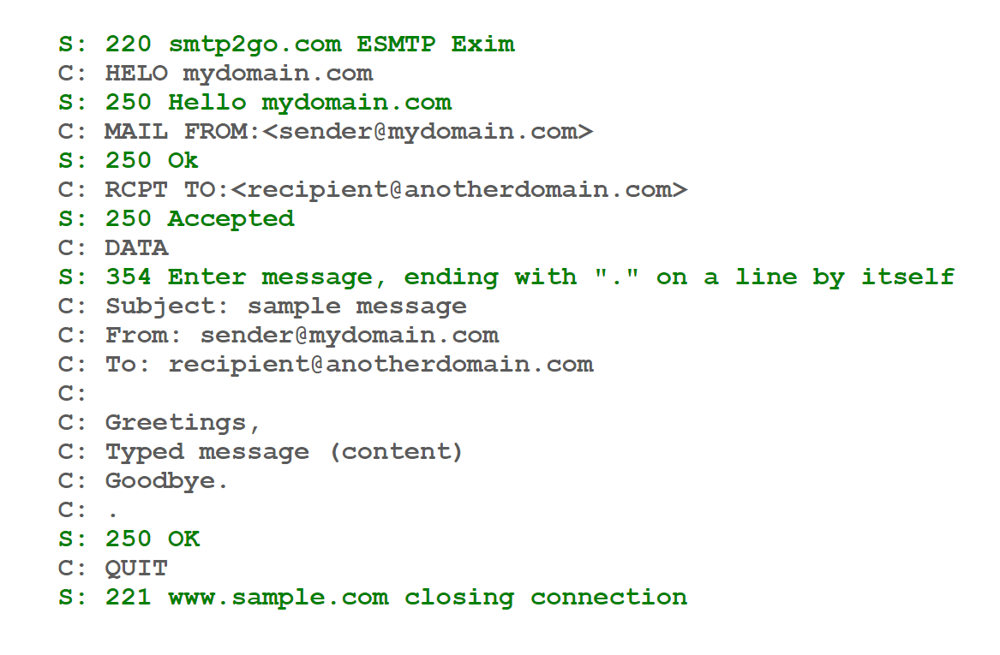
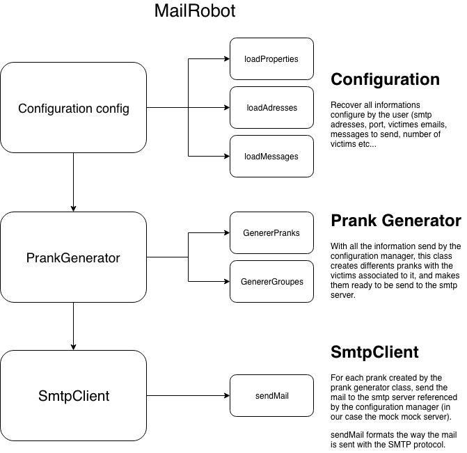
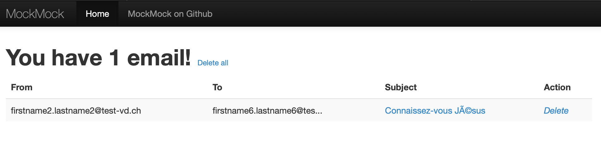
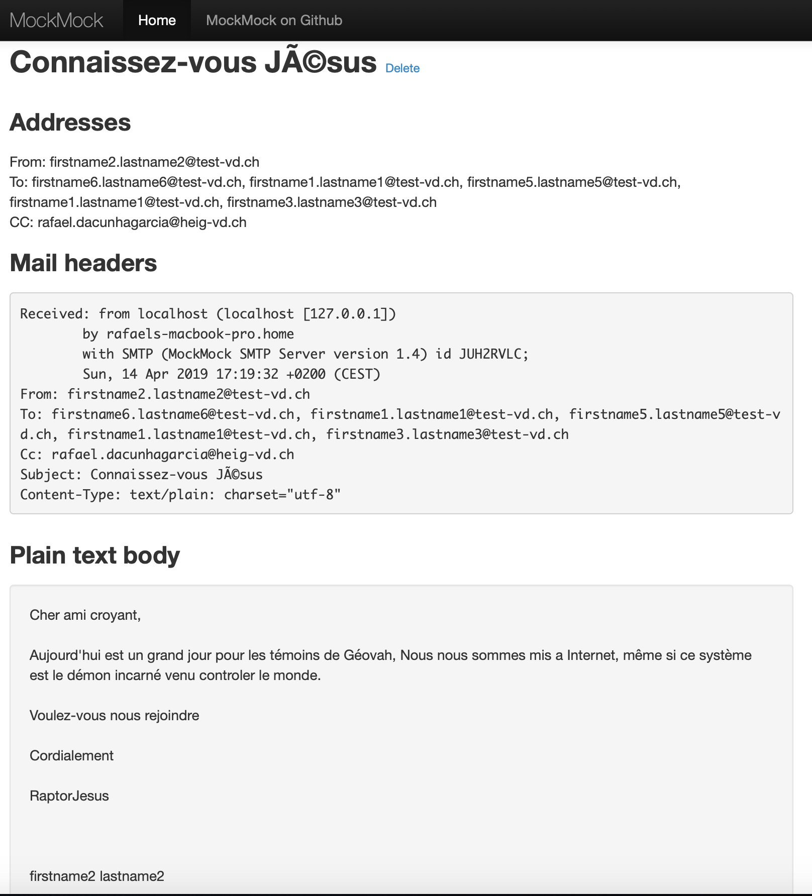
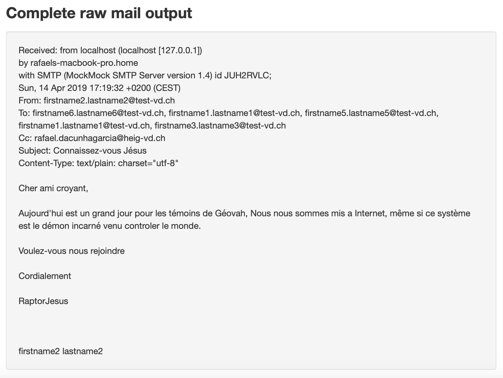

# README By Edoardo Carpita & Rafael Da Cunha Garcia

### A brief description of the project:
This program create a client application (TCP) in Java to send fake email from a list of victims. It will use the Socket API to communicate with a known SMTP server (address and port needed) created with a mockmock server (https://github.com/tweakers/MockMock).

### Prerequisite
To test your fake email safely and without the risks of being blacklisted, we strongly advise yout to set up a fake SMTP server to send your fake emails. For our testing phase we used a simple email server mocker called MockMock. Mockmock is simple and freely available on GitHub and you will be able to test if outgoing emails are sent (without actually sending them) and to see what they look like. It provides a web interface that displays which emails were sent and shows you what the contents of those emails are. You can clone the repo MockMock at this link https://github.com/tweakers/MockMock.

You have two ways to use MockMock in the dkr/MockMock folder:

#### Use the .jar directly

(You can use the .jar you find with this project or download it from github yourself, compile the program with maven )

Use in a bash console the following command from the target directory :

```
java -jar YourMockMockJarNameHere.jar -p 2525 -h 8282

Options:

-p 2525  : you can change the port to be used
-h 8282  : same as before with the http port for the web interface

(without options the default ports  are 25 (for SMTP) and 8282 (the web interface))
```

Once MockMock running, navigating with a browser to **localhost:8282** should you take to the web interface.

#### Build a Docker container

If your are familiar with the Docker Image system, we provide also a DOCKERFILE to build a custom constainer with the default port value. Use the two scripts to build and run the container. Run from a bash console

´´´
./build_image.sh
./run_container.sh

´´´

#### Clear and simple instructions for configuring your tool and running a prank campaign. 


To create your prank campaign, you will need to edit a couple of files so you create your own pranks. First of all :

- change the victimes.utf8 file :
    - add your own victimes, you only need to write the email address, example :
    
            firstname1.lastname1@test-vd.ch
            firstname2.lastname2@test-vd.ch
            firstname3.lastname3@test-vd.ch
            firstname4.lastname4@test-vd.ch
            firstname5.lastname5@test-vd.ch
            firstname6.lastname6@test-vd.ch

- change the messages file :
    - create your message that is going to be insert in the prank. Each messages are seperated by ``\n==\n``
    - you need to add a subject message, such as ``Subject : new prank`` 

            Subject: new Prank
            
            Hey,
            
            This is a prank generated by our little program.
            
            Cheers
            
            ==

- change the config properties file :
    - adding your server address and your server port.
- Then you build the project (got to repository and use `mvn clean install`).`
- a target repository will now appear, go on it and use the command java -jar RES_SMTP-1.0.jar`, but first you have to have the mockmock server on (see instructions before).

#### How does a SMTP protcol work ?

 

#### Description of the implementation

 

#### Output when you launch the programm in intelliJ

we added a log info for the example which show one by one what we are sending to the smtp server.

    Apr 14, 2019 5:19:32 PM smtp.SmtpClient sendMail
    INFO: Sending message via SMTP
    Apr 14, 2019 5:19:32 PM smtp.SmtpClient readResponse
    INFO: 220 rafaels-macbook-pro.home ESMTP MockMock SMTP Server version 1.4
    Apr 14, 2019 5:19:32 PM smtp.SmtpClient sendMail
    INFO: We write the command : EHLO localhost
    Apr 14, 2019 5:19:32 PM smtp.SmtpClient sendMail
    INFO: 250-8BITMIME
    Apr 14, 2019 5:19:32 PM smtp.SmtpClient sendMail
    INFO: 250 Ok
    Apr 14, 2019 5:19:32 PM smtp.SmtpClient sendMail
    INFO: We write the command (adding sender) : MAIL FROM: rafael.dacunhagarcia@test-vd.ch
    Apr 14, 2019 5:19:32 PM smtp.SmtpClient readResponse
    INFO: 250 Ok
    Apr 14, 2019 5:19:32 PM smtp.SmtpClient sendMail
    INFO: We write the command (adding To victims) : RCPT TO: erwan.moreira@test-vd.ch
    Apr 14, 2019 5:19:32 PM smtp.SmtpClient readResponse
    INFO: 250 Ok
    Apr 14, 2019 5:19:32 PM smtp.SmtpClient sendMail
    INFO: We write the command (adding To victims) : RCPT TO: firstname1.lastname1@test-vd.ch
    Apr 14, 2019 5:19:32 PM smtp.SmtpClient readResponse
    INFO: 250 Ok
    Apr 14, 2019 5:19:32 PM smtp.SmtpClient sendMail
    INFO: We write the command (adding To victims) : RCPT TO: gaetan.bacso@test-vd.ch
    Apr 14, 2019 5:19:32 PM smtp.SmtpClient readResponse
    INFO: 250 Ok
    Apr 14, 2019 5:19:32 PM smtp.SmtpClient sendMail
    INFO: We write the command (adding To victims) : RCPT TO: marion.dutulaunay@test-vd.ch
    Apr 14, 2019 5:19:32 PM smtp.SmtpClient readResponse
    INFO: 250 Ok
    Apr 14, 2019 5:19:32 PM smtp.SmtpClient sendMail
    INFO: We write the command (adding To victims) : RCPT TO: firstname4.lastname4@test-vd.ch
    Apr 14, 2019 5:19:32 PM smtp.SmtpClient readResponse
    INFO: 250 Ok
    Apr 14, 2019 5:19:32 PM smtp.SmtpClient sendMail
    INFO: We write the command (adding To victims) : RCPT TO: remy.vuagniaux@test-vd.ch
    Apr 14, 2019 5:19:32 PM smtp.SmtpClient readResponse
    INFO: 250 Ok
    Apr 14, 2019 5:19:32 PM smtp.SmtpClient sendMail
    INFO: We write the command (adding Cc victimes) : RCPT TO: rafael.dacunhagarcia@heig-vd.ch
    Apr 14, 2019 5:19:32 PM smtp.SmtpClient readResponse
    INFO: 250 Ok
    Apr 14, 2019 5:19:32 PM smtp.SmtpClient sendMail
    INFO: We write the command (Telling we are starting de message): DATA
    Apr 14, 2019 5:19:32 PM smtp.SmtpClient readResponse
    INFO: 354 End data with <CR><LF>.<CR><LF>
    Apr 14, 2019 5:19:32 PM smtp.SmtpClient sendMail
    INFO: We write the message (too long to add it but you have an example before): 
    Apr 14, 2019 5:19:32 PM smtp.SmtpClient readResponse
    INFO: 250 Ok
    Apr 14, 2019 5:19:32 PM smtp.SmtpClient sendMail
    INFO: We write the command to quit the test: QUIT

#### On the mock mock server



And if we click on the mail : 



